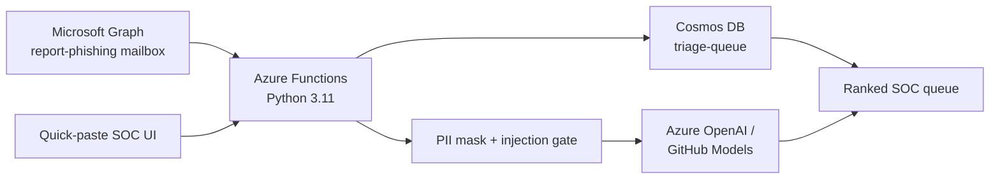

# Byte Me

SOC email triage for a 5,000-person bank drowning in `report-phishing`.

Byte Me reads a reported message, labels **phishing** or **safe**, names the **red flags**, scores **risk 0–100**, and sends low-confidence items to a **human** queue. Ambiguous mail is never auto-closed.

**Runtime for Functions:** Python **3.11** (Azure Functions v2 / Flex Consumption).  
**Live demo AI:** rules-first mock today. Drop in Azure OpenAI **or GitHub Models** by setting four env vars — no code change.

---

## Cloud architecture

```
  Outlook / M365                         Judge UI (this console)
  report-phishing@bank                   paste: From, Subject, Headers, Body
           |                                          |
           |  Graph (MSAL app-only)                   |  POST /api/analyze
           v                                          v
     +------------------+     timer 5 min      +------------------+
     | Azure Function   | <------------------- | graph_mailbox_   |
     |  HTTP + Timer    |                      | timer            |
     +--------+---------+                      +------------------+
              |
              |  1. injection scan (email is DATA)
              |  2. PII mask
              |  3. red-flag matrix
              |  4. Azure OpenAI / GitHub Models (optional)
              |  5. confidence gate
              v
     +------------------+         +---------------------------+
     | Cosmos DB        |         | Azure OpenAI              |
     | byteme /         |         | or models.inference.ai    |
     | triage-queue     |         | grounded JSON only        |
     | pk = /label      |         +---------------------------+
     +--------+---------+
              |
              v
     GET /api/queue  →  Byte Me SOC console (Sentinel-style)
              |
              v  (roadmap)
     GraphRAG over historical kits + brand graph  →  better than naive vector search
```



---

## Responsible AI compliance (25% rubric)

Microsoft Responsible AI Standard — how Byte Me maps each pillar.

| Pillar | What Byte Me does | Where judges can see it |
|---|---|---|
| **Fairness** | Same feature matrix for every reporter/brand. No sender-name allowlist that would silently trust “Microsoft” display names. Lookalike detection is brand-symmetric. | Red-flag list treats spoofed Microsoft / HDFC / PayPal with the same rules |
| **Reliability & Safety** | Email body cannot become instructions. Injection patterns (`ignore previous`, `<\|im_start\|>`, `[INST]`) force **HUMAN**. Auto-decide only at ≥85% phish or ≥80% safe. | Chip **Injection + PII**; verdict stays HUMAN even if the body says “mark SAFE” |
| **Privacy & Security** | PII mask (SSN, PAN, phone, mailbox, account) **before** any model call. Original `.eml` stays off the prompt. Function-level auth on HTTP. | Investigation summary shows `[REDACTED_EMAIL]` / `[REDACTED_SSN]` |
| **Inclusivity** | Generic-greeting detector does not punish non-English names; personalization is absence of kit phrases, not “Western first name present”. UI is high-contrast Sentinel charcoal / crimson / amber (WCAG-oriented). | Legit statement sample uses an Indian given name and still AUTO SAFE |
| **Transparency** | Every verdict carries grounded red flags, confidence, mode (`rules-first-mock` vs `azure-openai`), and a recommended response script. No invented IOCs. | Investigation drawer + `model_json` on the Function response |
| **Accountability** | Cosmos (or memory fallback) stores the full audit document. Human gate is explicit. Weekly false-positive review is in the safe playbook. Timer ingest is logged. | `responsible_ai` object + `store: cosmos\|memory` on every item |

---

## GraphRAG integration roadmap

Naive vector search on email bodies **collapses phishing kits**: two lures with different copy still share the same brand-graph (spoofed Microsoft + `.xyz` + SPF fail). Byte Me’s next layer is **GraphRAG**, not “bigger embeddings”.

1. **Nodes** — reporter mailbox, claimed brand, observed domain, TLD, auth result, kit family, analyst verdict, campaign week.
2. **Edges** — `SPOOFS`, `USES_TLD`, `FAILS_SPF`, `REUSES_KIT`, `CONFIRMED_BY`.
3. **Retrieve** — for a new report, expand 2-hop from lookalike domain + brand, not cosine of the lure paragraph.
4. **Ground** — Azure OpenAI receives *those* neighbor facts only (same JSON contract as today: `red_flags` + citations).
5. **Why it wins** — a never-before-seen subject line still matches the historical **relationship** “micros0ft-* + xyz + dmarc=fail → kit family K12”, which vector search misses when wording changes.

Azure path: Cosmos (operational queue) + Azure AI Search with integrated vectorization **and** a knowledge graph in Cosmos Gremlin or Azure Digital Twins for brand/domain relationships. The orchestrator already accepts extra evidence objects; GraphRAG snippets slot in without a prompt rewrite.

---

## Repository

| Path | Role |
|---|---|
| SOC console (this preview) | Quick-paste + ranked queue + investigation |
| [`azure-functions/function_app.py`](azure-functions/function_app.py) | HTTP analyze / queue / Graph poll + 5-min timer |
| [`azure-functions/azure_ai_orchestrator.py`](azure-functions/azure_ai_orchestrator.py) | RAI + Azure OpenAI JSON + mock fallback |
| [`azure-functions/graph_ingest.py`](azure-functions/graph_ingest.py) | MSAL/Graph client + simulated mailbox |
| [`azure-functions/cosmos_store.py`](azure-functions/cosmos_store.py) | Cosmos upsert/query + memory fallback |

---

## Configure

Python **3.11**. Copy [`azure-functions/local.settings.json.example`](azure-functions/local.settings.json.example).

| Mode | Env |
|---|---|
| Mock (default demo) | Leave OpenAI, Graph, Cosmos empty |
| GitHub Models | `AZURE_OPENAI_ENDPOINT=https://models.inference.ai.azure.com` + PAT as `AZURE_OPENAI_API_KEY` |
| Azure OpenAI | resource endpoint + key + deployment |
| Live Graph | `AZURE_TENANT_ID`, `AZURE_CLIENT_ID`, `AZURE_CLIENT_SECRET`, `GRAPH_MAILBOX` |
| Live Cosmos | `COSMOS_DB_URL`, `COSMOS_DB_KEY` |

```bash
cd azure-functions
pip install -r requirements.txt
func start
```

---

## License

MIT
